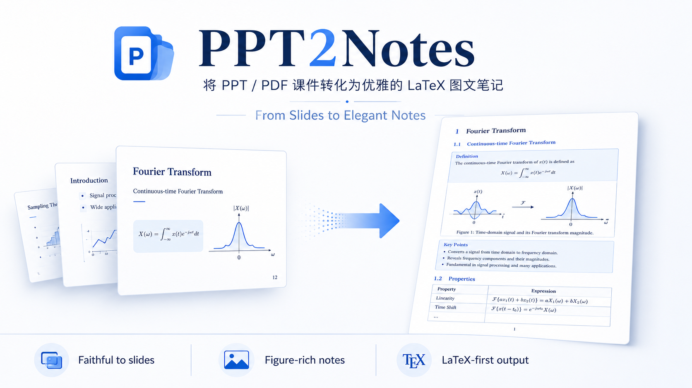
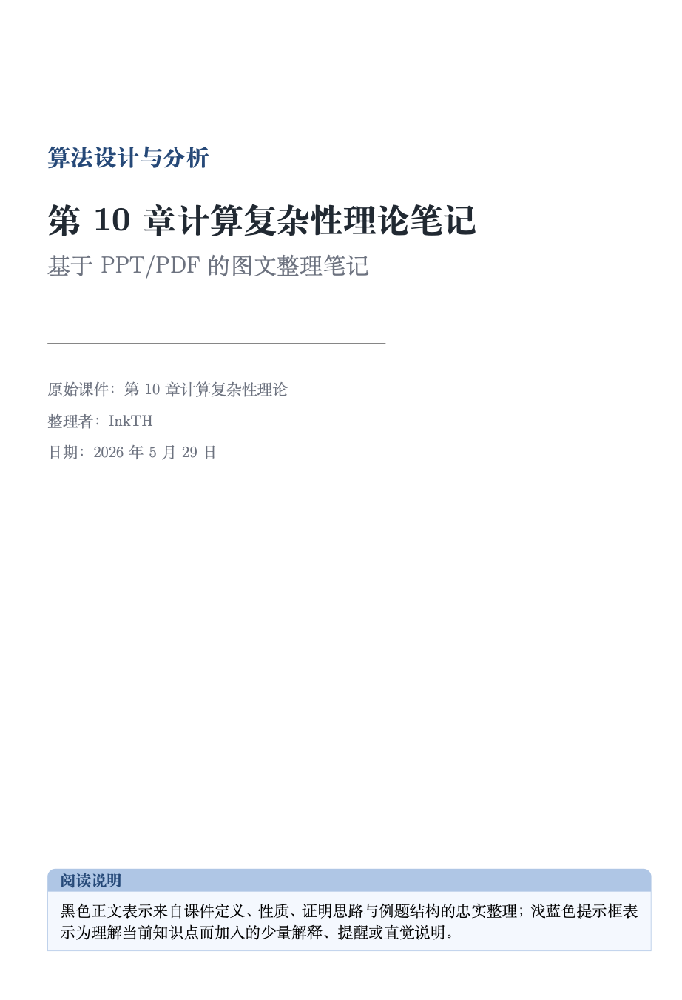
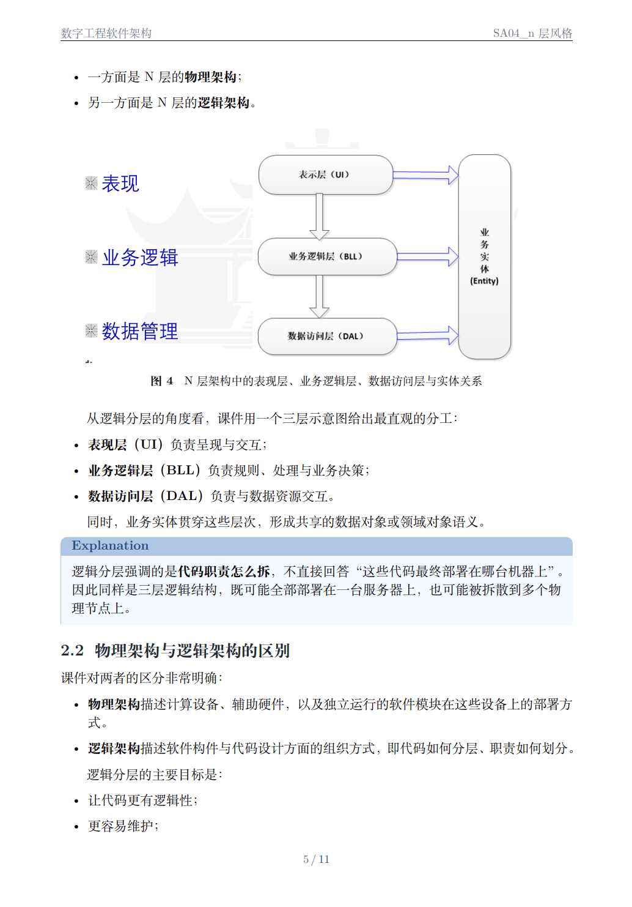
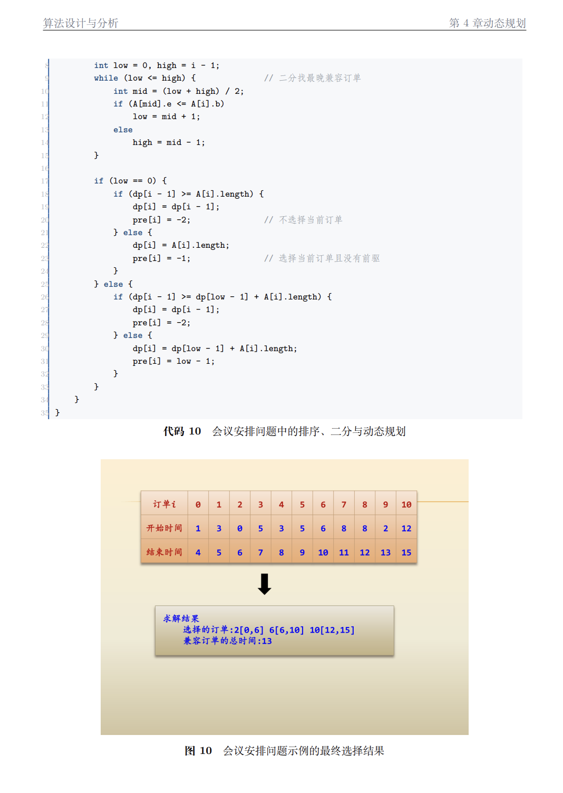

# ppt2notes

将单个课程 PPT / PPTX / PDF 讲义整理为忠实、清晰、可编译的中文 LaTeX 课程笔记，并输出最终 PDF。

这个仓库只包含一个 Skill，本体在 [`ppt2notes/SKILL.md`](./ppt2notes/SKILL.md)，展示素材放在 [`docs/images/`](./docs/images/)，示例成果放在 [`example/`](./example/)。

## Preview



<table>
  <tr>
    <td></td>
    <td></td>
    <td></td>
  </tr>
</table>

## What This Skill Does

- 接收单个课件文件：`.ppt`、`.pptx`、`.pdf`
- 基于原始讲义内容生成结构化中文笔记
- 使用 LaTeX 模板排版，并输出可编译 `tex` 与最终 `pdf`
- 保留课件主内容为黑色正文，把 AI 补充说明放进浅蓝色说明框
- 在有助于理解时，从原始页中裁切并插入关键图片

## Repository Layout

```text
.
├── README.md
├── docs/
│   └── images/          # README 展示图
├── example/             # 示例输出 PDF
└── ppt2notes/
    ├── SKILL.md         # Skill 本体
    └── assets/
        └── notes-template.tex
```

## Install

把这个仓库中的 `ppt2notes/` 目录放到 Codex skills 目录下即可：

```bash
mkdir -p ~/.codex/skills
cp -R ./ppt2notes ~/.codex/skills/
```

安装后，Skill 会以 `ppt2notes` 被发现。

也可以直接从你发布后的 GitHub 仓库拉取：

```bash
git clone <your-repo-url>
cp -R ./ppt2notes-skill/ppt2notes ~/.codex/skills/
```

## Usage

在 Codex 中直接描述任务，例如：

```text
用 ppt2notes 把 slides/第4章_动态规划.pdf 整理成中文 LaTeX 笔记，并输出 PDF。
```

适合的输入是“单个章节 / 单个课件”。默认目标是生成适合复习、开卷使用、课堂整理的图文笔记，而不是题库、押题或整本教材重写。

## Example Outputs

- [`example/第4章_动态规划_notes.pdf`](./example/第4章_动态规划_notes.pdf)
- [`example/第10章_计算复杂性理论_notes.pdf`](./example/第10章_计算复杂性理论_notes.pdf)
- [`example/SA04_软件架构风格_notes.pdf`](./example/SA04_软件架构风格_notes.pdf)

## Design Boundary

- 以原始课件为主，不默认引入教材、网页或外部资料
- 黑色正文只承载课件原生信息或忠实压缩改写
- AI 自行补充的解释、例子、直觉说明放入蓝色说明框
- 重点是“整理成高质量课程笔记”，不是“扩写成百科”

## Notes

- Skill 主规范见 [`ppt2notes/SKILL.md`](./ppt2notes/SKILL.md)
- LaTeX 模板见 [`ppt2notes/assets/notes-template.tex`](./ppt2notes/assets/notes-template.tex)
- 发布步骤见 [`docs/publish.md`](./docs/publish.md)
- 本仓库默认使用 [`MIT License`](./LICENSE)
